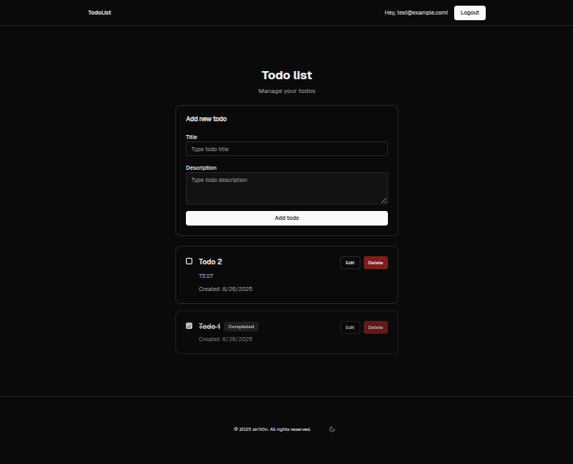

# next-todolist

 Example todo list using Next.js, Supabase and Zustand.

  <a href="#tech-stack"><strong>Tech stack</strong></a> ·
  <a href="#features"><strong>Features</strong></a> ·
  <a href="#demo"><strong>Demo</strong></a>

## Tech stack

- [Next.js](https://nextjs.org)
- [Supabase](https://supabase.com)
- [shadcn/ui](https://ui.shadcn.com)
- [Zustand](https://github.com/pmndrs/zustand)
- [React Testing Library](https://testing-library.com/docs/react-testing-library/intro/)
- [Jest](https://jestjs.io/)

## Features

- Guests can view todos.
- Guests can log in to create, edit or delete their todos.
- Supabase is used for data storage and auth.
- Zustand is used to store the application state on the client.

## Demo

You can view a fully working demo at [next-todolist-sk1t0n.vercel.app](https://next-todolist-sk1t0n.vercel.app/).

